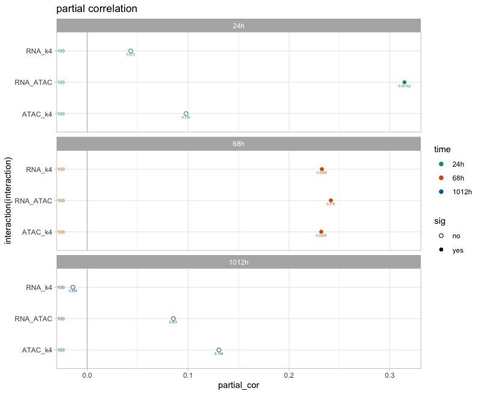

# partial_correlation

This repository contains scripts to perform a partial correlation analysis. Here, we show how to perform it with three variables, using the package GeneNet and also "from scratch" by computing the residuals from a linear regression.

Running the script on a subset of 100 data points from each of the three time points, we generate the following graphs :

