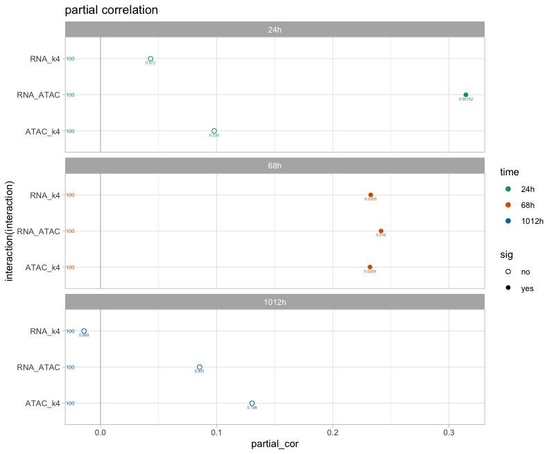
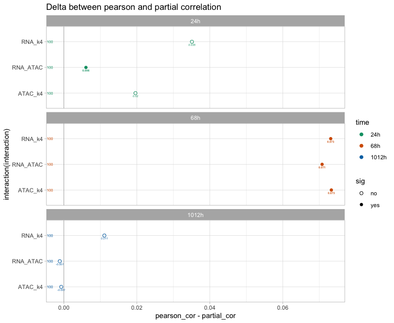
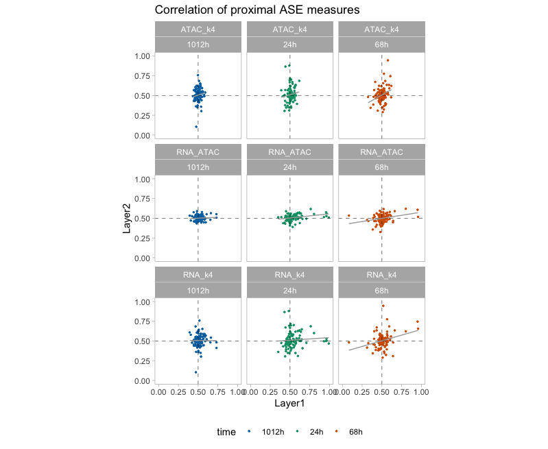
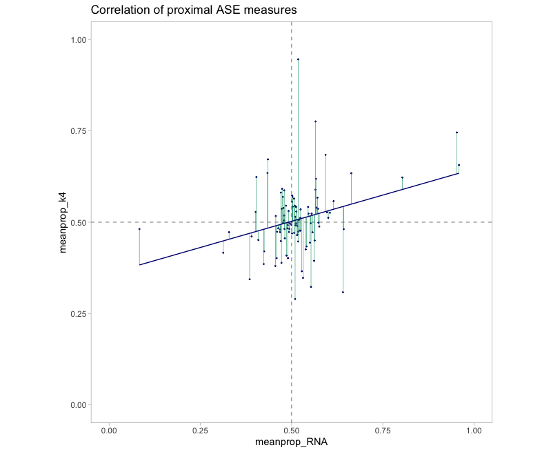
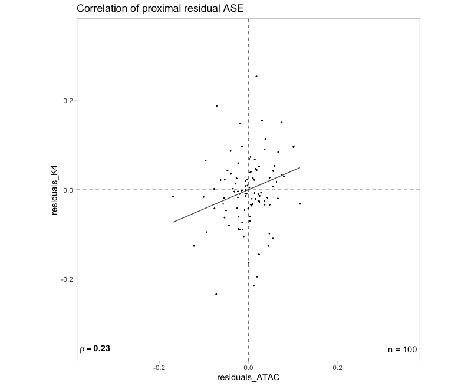

# partial_correlation

This repository contains scripts to perform a partial correlation analysis. Here, we show how to perform it on allelic ratio data for three variables (ATAC, RNA, H3K4me3), using the package GeneNet and also "from scratch" by computing the residuals from a linear regression.

Running the script on a subset of 100 data points from each of the three time points, we generate the following graphs :

Partial correlation result generated with GeneNet :

Delta between partial correaltion and standard Pearson correlation :

Scatter plot of the allelic ratio for each pairwise comparison and time point :

Residuals (green lines) obtained from regressing RNA signal from H3K4me3 signal :

Partial correlation between ATAC and H3K4me3 at 6-8h, obtained by correlating the residuals against RNA signal for both variables (ATAC and H3K4me3) :

Note that with both methods, we recapitualte the same partial correlation values of 0.23 between ATAC and H3K4me4 at 6-8h for this subset of data.

